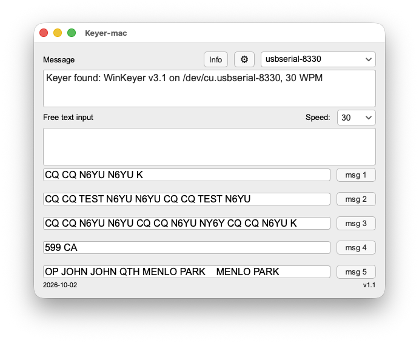

# Keyer-mac



Keyer-mac is an auto keyer for the Mac that talks to a K1EL **WinKeyer Mini** over USB. Type free text or press one of five canned-message buttons and the keyer sends it as CW; a speed dropdown (6–34 WPM) and a settings dialog control how it sends, and a Message box shows what was sent and the connection status. It finds the keyer by itself, re-sends every setting on each connect, explains failures with time-stamped reasons, and offers a local XMLRPC bridge (port 8000) so logging software can fire CW macros. It is a Mac rewrite of Michael Bridak's (K6GTE) [PyWinKeyerSerial](https://github.com/mbridak/PyWinKeyerSerial), built from a written plan and checked against a real WK-mini.

## Running

```
cd ~/Projects/keyer-mac
source .venv/bin/activate
python3 -m keyer_mac
```

Plug the keyer in before or after launching. The Message box counts down "Scanning for keyer… 8", then shows "Keyer found: WinKeyer v3.1 on /dev/cu.usbserial-…, 20 WPM". If it cannot connect it says why and tries again every 8 s; plugging the keyer in connects within about 2 s. Settings and messages are saved in `~/.keyer-mac.json` (set `KEYER_MAC_CONFIG_PATH` to redirect it). Only one window can use the keyer at a time. The setup notes for this machine are in `MAC-SETUP.md`.

## Key files

| File | What it is |
|---|---|
| `masterplan.md` | The v1.1 plan the app was built from: Constitution (rules), Spec, Tech, Tasks. Source of truth for behavior and known limitations. |
| `masterplan-generator.md` | The prompt guide used to produce the masterplan (summarized below). |
| `idea.md` | The v1.1 app brief that fed the generator: features, screen, start-up rules. |
| `keyer-mac-1.1.png` | Screenshot of the running app (above). |
| `keyer-mac-running.png`, `keyer-win-ui.png` | The two reference screenshots the layout was measured from. |
| `keyer_mac/` | The app: `ui.py` (window), `worker.py` (serial thread, reconnect), `winkeyer.py` (protocol), `ports.py` (find the keyer), `config.py` (JSON file), `bridge.py` (XMLRPC), `settings.py` (mode dialog). |
| `tests/` | The unit suite (`python -m pytest`), headless and with a redirected `$HOME`. |
| `tools/` | Live checks against a real keyer (`live_*.py`, including the measured-speed check) and `ui_fidelity_check.py` with `ui_targets.json`, the numeric layout targets. |
| `masterplan-old.md`, `deviation-log.md` | The v1.0 plan and its deviation log (history). |
| `LICENSE` | GPL-3.0-or-later, inherited from PyWinKeyerSerial. |

## How the masterplan was made: `masterplan-generator.md` by section

- **Overview and label key.** You answer five questions about your app, then paste 20 prompts into Claude Code. Each prompt starts with a label: RULE (write it down, follow it later), DRAFT (write it now and show me), USER INPUT (ask me first), SET (use my answer as given), PASTE (an instruction to paste as is).
- **Before you start.** Install Claude Code and start it in the app's folder. Then give it a screenshot of an app like yours, answer the five brief questions (saved as `idea.md`), give the folder its own git repo, create an empty `masterplan.md` with four headings, and paste the label legend once.
- **1. Constitution (how we work).** Five RULE lines: build only from the plan, brief and screenshots; check tools, repo and connections first; measure the screen after each change; run tests, commit and push after each step; propose plan changes one line at a time and wait for approval.
- **2. Spec (what the app does).** Five prompts, one at a time: summarize the app, list screen elements and where each sits, describe every feature with testable ranges, list data sources and how each is checked (including after a reconnect), and ask which features are in this iteration.
- **3. Tech (what it is built with).** Recommend a language and tools and let me choose; list what must be installed and how to check it; keep the app responsive; propose a handful of independently testable modules; keep a short list of known limitations.
- **4. Tasks (in what order).** About five stages: environment (including measuring the screenshot with a script), live data connections ending in a bare window, core logic, features one at a time, UI. Each sub-step has a test and a done-when line, plus a final review step.
- **After you finish.** Tighten the plan (keep every number and rule), review it, pressure-test it for ambiguity, commit and push it, then start a fresh session and build from it, starting with Task 1.
- **Watch for.** "Looks close" is not a pass; stop after two failed fixes on the same bug; "should work" means untested; a data-source failure needs likely causes; never change a test just to pass it; note borrowed code's license; keep the plan tight, not thin.

## License

GPL-3.0-or-later, inherited from the source project. See `LICENSE`.

## Status

v1.1 is built per `masterplan.md` (from `idea.md`) and checked on a real WK-mini (firmware 3.1), 2026-10-02: handshake, free text, five canned messages, speed (measured from the keyer's own echo timing), the settings dialog, all six XMLRPC methods, reconnect after unplug/replug, and exclusive port use. Known limitations are listed in `masterplan.md`.
