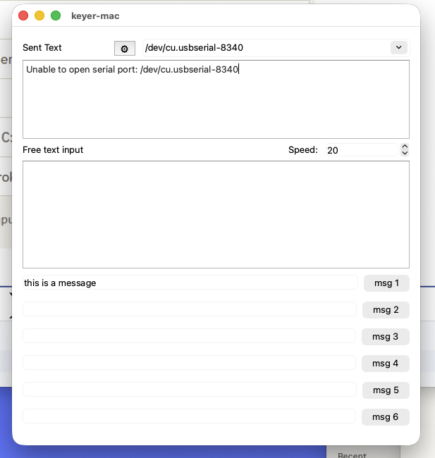

# keyer-mac

A macOS PyQt6 app that talks to a K1EL WinKeyer over serial, sends typed
and canned CW messages, and exposes a local XMLRPC bridge for logging
software macros.

This is a macOS port of Michael Bridak's (K6GTE) **PyWinKeyerSerial**:
https://github.com/mbridak/PyWinKeyerSerial. Core logic (WinKeyer
protocol, mode-register bit packing, XMLRPC bridge) is ported directly
from that project to preserve proven protocol behavior; see
`masterplan-seed.md` for the full plan and `deviation-log.md` for every
place this port deviates from the source.

## Running

```
source .venv/bin/activate
python3 -m keyer_mac
```

Verified 2026-09-08 against a real K1EL WinKeyer at
`/dev/cu.usbserial-8340`: window opens titled "keyer-mac", device
dropdown auto-detects the connected WinKeyer, speed spinbox syncs to
the physical speed-pot position, all 6 canned-message fields/buttons
and the settings gear are present. Config persists to
`~/.keyer-mac.json` (set `KEYER_MAC_CONFIG_PATH` to redirect it, e.g.
for tests).



Screenshot from 2026-09-13: window launched with no WinKeyer attached,
showing the "Unable to open serial port" status line, default 20 WPM
speed, and the msg 1–6 canned-message buttons.

## License

GPL-3.0-or-later, inherited from the source project. See `LICENSE`.

## Status

In development — see `masterplan-seed.md` Tasks for current progress.
